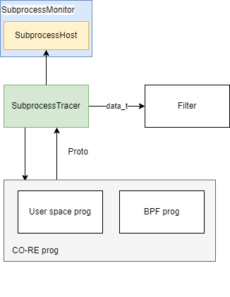
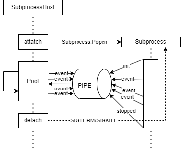

# CO-RE and SubprocessMonitor [#44](https://github.com/hitsz-ids/duetector/issues/44)

## 1. Introduction of CO-RE

> If you already familiar with [CO-RE](https://facebookmicrosites.github.io/bpf/blog/2020/02/19/bpf-portability-and-co-re.html), you can skip this section.

### 1.1 Problem

A BPF program is a piece of user-provided code which is injected straight into a kernel. Inevitably, a dependency on kernel data structures will be introduced. Unfortunately, the data structure of the kernel is not set in stone.

> In such cases, how do you make sure you are not reading garbage data when some kernel added an extra field before the field you thought is, say, at offset 16 from the start of `struct task_struct`? Suddenly, for that kernel, you'll need to read data from, e.g., offset 24. And the problems don't end there: what if a field got renamed, as was the case with `thread_struct`'s `fs` field (useful for accessing thread-local storage), which got renamed to `fsbase` between 4.6 and 4.7 kernels.

All this means that you can no longer compile your BPF program locally using kernel headers of your dev server and distribute it in compiled form to other systems, while expecting it to work and produce correct results. **This is because kernel headers for different kernel versions will specify a different memory layout of data your program relies on.**

### 1.2 Status quo

One possible solution is to compile the BPF program in real-time on the actual running machine. This is what [BCC](https://github.com/iovisor/bcc/) did and our `BccTracer` is based on it. However, this approach has a few drawbacks:

- Clang/LLVM combo is a big library, resulting in big fat binaries that need to be distributed with your application.(We do suffer from this problem.)
- Clang/LLVM combo is resource-heavy, so when you are compiling BPF code at start up, you'll use a significant amount of resources, potentially tipping over a carefully balanced production workfload. And vice versa, on a busy host, compiling a small BPF program might take minutes in some cases.(Yes, it's slowing down our startup and causes a large performance impact when popping containers at scale.)
- You are making a big bet that the target system will have kernel headers present, which most of the time is not a problem, but sometimes can cause a lot of headaches. (Yes, see [how-to/run-with-docker](../how-to/run-with-docker.md))
- BPF program testing and development iteration is quite painful as well. (Yes, we haven't found a good way to test BPF programs:[#47](https://github.com/hitsz-ids/duetector/issues/47).)

### 1.3 BPF CO-RE helps

BPF CO-RE, by making the kernel self-contained information, together with a BPF loader, allows BPF programs to be compiled offline, and then loaded into the kernel without the need to recompile them on the target system. This is a huge improvement over the status quo.

BPF CO-RE requires the following parts:

- BTF type information, which allows to capture crucial pieces of information about kernel and BPF program types and code, enabling all the other parts of BPF CO-RE puzzle;
- BPF loader ([libbpf](https://github.com/libbpf/libbpf)) ties BTFs from kernel and BPF program together to adjust compiled BPF code to specific kernel on target hosts;
- kernel, while staying completely BPF CO-RE-agnostic, provides advanced BPF features to enable some of the more advanced scenarios.

There are three language have its own CO-RE implementation:

- C: [libbpf](https://github.com/libbpf/libbpf)
- Rust: [aya-rs](https://github.com/aya-rs/aya)
- Go: [cilium/ebpf](https://github.com/cilium/ebpf), it transforms C code to Go code and then compile it.

### 1.4 Requirements of CO-RE

| Feature               | Kernel version | Commit                                                                                             |
| --------------------- | -------------- | -------------------------------------------------------------------------------------------------- |
| BPF Type Format (BTF) | 4.18           | [`69b693f0aefa`](https://github.com/torvalds/linux/commit/69b693f0aefa0ed521e8bd02260523b5ae446ad7) |

> Note:
>
> - If one `SubprocessTracer` not based on `CO-RE`, it will not require BTF.

## 2 Introduction of SubprocessMonitor

`SubprocessMonitor` will provide support for subprocess-based tracer.Its primary goal is to support the CO-RE program. This is because CO-RE programs are often written through the underlying language(C/Rust). It's hard to write a CO-RE program in Python(CPython may support, but it's not a good idea). And It's hard for C/Rust to write a `duetector`-like program. So `SubprocessMonitor` will provide a way to write a CO-RE program in C/Rust and use it in Python. Instead of writing cumbersome programs in userspace, C/Rust users simply communicate with `SubprocessMonitor` through a protocol.

Furthermore, `SubprocessMonitor` also support non-BPF program, as long as it can be run in a subprocess and obey the protocol.

## 3. Protocol

**This is a very early experimental Protocol with a high probability of extreme variability, and at the same time, many of the fields are undefined**

### 3.1 Protocol Definition

#### 3.1.1 Message Format

```python
{
    "proto": "duetector", // or opentelemetry if type is event
    "type": "" // init, event, stop, stopped
    "version": "0.1.0", // protocol version
    "payload":{}
}
```

#### 3.1.2 Init Message

##### From host(reqeust)

type: `init`

payload:
- `poll_time`: unit: seconds
- `kill_timeout`: unit, seconds
- `config`: object, config of tracer

##### From subprocess(response)

type: `init`

payload:
- `name`: string, name of tracer
- `version`: string, version of tracer

#### 3.1.3 Event Message

##### From host

type: `event`

payload:

##### From subprocess

type: `event`

payload: object of tracking data or OpenTelemetry OTLP things

#### 3.1.3 Stop Message

##### From host

type: `stop`

payload:

##### From subprocess

type: `stopped`

payload:

### 3.2 Intergation with OpenTelemetry

After we intro OpenTelemetry in [#25](https://github.com/hitsz-ids/duetector/issues/25), we can support OpenTelemetry protocol to passthrough the `Event` message.

## 4. Design

### 4.1 Architecture



### 4.2 State Transfer & Failure Handling



- When a `SubprocessTracer` `attatch` to the `SubprocessHost`, host will `Popen` a subprocess and send `init` message to subprocess.
- After the subprocess is started, subprocess will send a `init` message to host.
- Subprocess will send `Event` message to host when it has something to report.
- Host will poll the subprocess's stdout and stderr periodically and send `Event` message to subprocess.
- When `detach` is called, host will send SIGTERM and `stop` message to subprocess and wait for subprocess to exit, if subprocess doesn't exit in `kill_timeout` seconds, host will send SIGKILL to subprocess.
- When subprocess stops, it will send a `stopped` message to host.

#### When Host Process Crashes

In this case, subprocess becomes an orphan process. It will be adopted by `init` process and continue to run. Subprocess will no longer receive `Event` message from host. No message is received within twice or more `poll time``, subprocess can be assumed that the host process has crashed. Subprocess will send a `stopped` message to host and exit.

#### When Subprocess Crashes

In this case, host can check subprocess is alive or not. If subprocess is not alive, host should log an `warming` for every poll.

Host can be configured to restart subprocess when subprocess crashes for a certain number of times.

## 5. Migration

### 5.1 Migration from BccTracer

1. Reimplement `Tracer` in C/Rust/Go
2. Commit code to [/CORE](../../CORE/)
3. Implement `SubprocessTracer` in `duetector`

Note:

- Need to add the corresponding Github Action to compile the code and upload the binary to Github Release.
- Need to change our docker image to include the binary.

## 6. Others

- Support `SubprocessTracer` template in `TracerManager`
