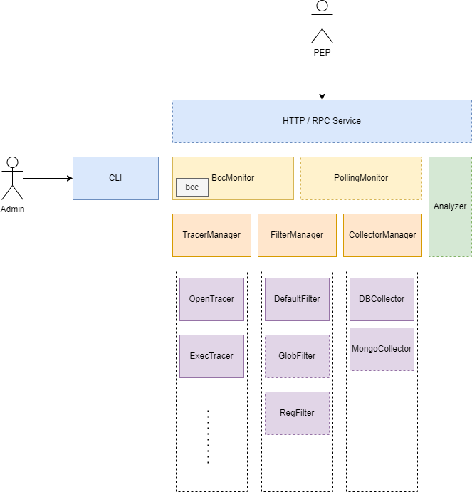

# Architecture

Key Components and Features:

- [ ] **HTTP / RPC Server**: PIP Server, providing API for PDP to get data usage information.
- [ ] **Analyzer**: Analyze data usage information and generate data usage behavior.
  - [ ] **DBAnalyzer**: Analyze data usage information from database.
- [X] **CLI**: CLI for administrator to manage duetector.
- [X] **BccMonitor**: Monitor data usage behavior in kernel space. Use BCC to implement.
- [X] **ShMonitor**: A general monitor for custom command. Polling the output of command.
- [X] **TracerManager**: Manage tracers, support plugin.
  - [X] **OpenTracer**: A `bcc` tracer, trace `open` syscall.
  - [ ] ...
- [X] **FilterManager**: Manage filters, support plugin.
  - [X] **DefaultFilter**: Filtering some meaningless information
  - [ ] ...
- [X] **CollectorManager**: Manage collectors, support plugin.
  - [X] **DBCollector**: Collect filted trackings and store them into database.
  - [ ] ...

# Data Flow

Current data flow implementation:

1. Register **Tracer's** `callback` to host, and start **Monitor**.
2. Once **Monitor's** `poll` is called, it will trigger **Tracer's** `callback`
3. **Tracer's** `callback` will call **Filter** to filter the data.
4. **Filter's** `filter` will call **Collector's** `emit` to collect the data.

The following are not yet realized and may be subject to change.

- [ ] **Analyzer**'s data stracture and API.
- [ ] **Query Service** will get data from **Analyzer**.
