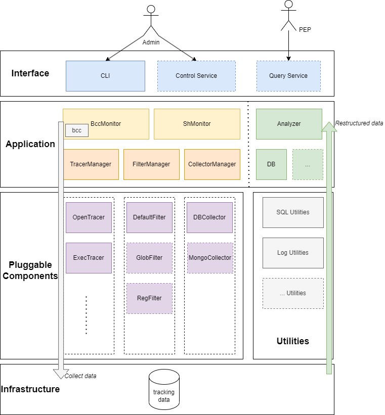
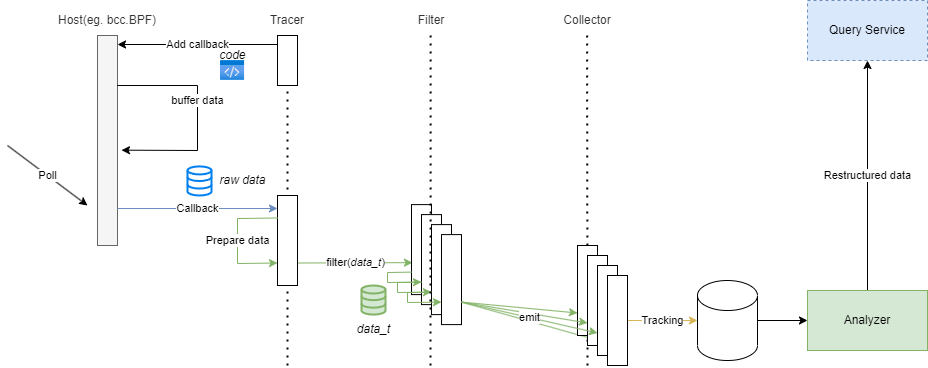

# Architecture

Key Components and Features:

- [ ] Control Server: Control plane, providing API for administrator to manage duetector.

- [x] Query Server: PIP Server, providing API for PDP to get data usage information.

- [x] **Analyzer**: Analyze data usage information and generate data usage behavior.

  - [x] **DBAnalyzer**: Analyze data usage information from database.

- [x] **CLI**: CLI for administrator to manage duetector.

- [x] **BccMonitor**: Monitor data usage behavior in kernel space. Use BCC to implement.

- [x] **ShMonitor**: A general monitor for custom command. Polling the output of command.

- [ ] **SubprocessMonitor**: A subprocess monitor for subprocesses. Manage subprocesses and daemonize them.

- [x] **TracerManager**: Manage tracers, support plugin.

  - [x] **OpenTracer**: A `bcc` tracer, trace `open` syscall.
  - [ ] ...

- [x] **FilterManager**: Manage filters, support plugin.

  - [x] **DefaultFilter**: Filtering some meaningless information
  - [ ] ...

- [x] **CollectorManager**: Manage collectors, support plugin.

  - [x] **DBCollector**: Collect filted trackings and store them into database.
  - [ ] ...

# Data Flow

Current data flow implementation:

1. Register **Tracer's** `callback` to host, and start **Monitor**.
1. Once **Monitor's** `poll` is called, it will trigger **Tracer's** `callback`
1. **Tracer's** `callback` will call **Filter** to filter the data.
1. **Filter's** `filter` will call **Collector's** `emit` to collect the data.
1. **Analyzer** restructure the data and provide query and analysis API.
1. **Query Service** expose API for **PDP** to query data usage information.
