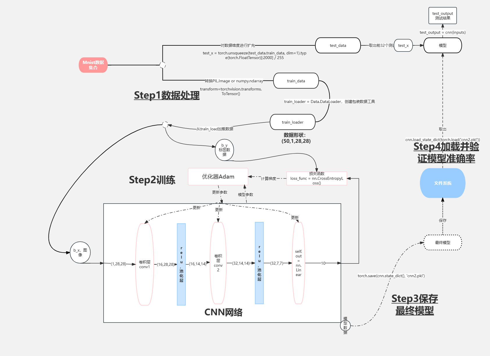
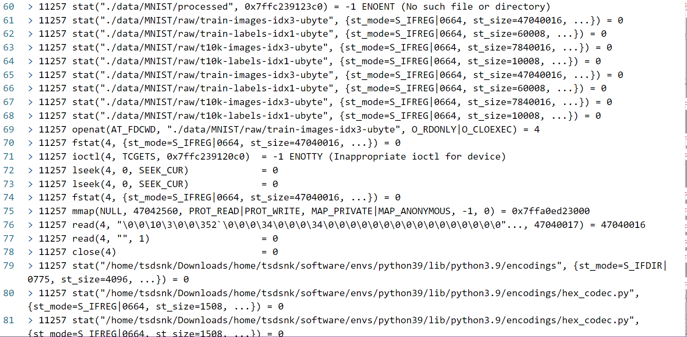
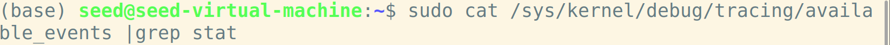
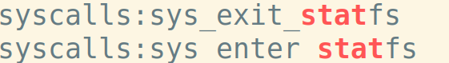
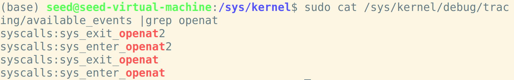
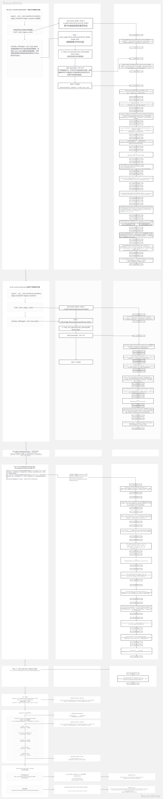

# 基于机器学习的mnist实验的文件数据流使用监控实验报告

## 机器学习的基于mnist数据集的torch实验分析，在实验过程中使用数据、产生中间结果、生成和保存最终模型三个工程中对数据的工作流

下面根据实验代码，按照对mnist数据下载、处理，神经网络的定义、训练、保存、加载并验证的流程对数据流进行分析。

数据集采用mnist，第一步从网络下载mnist，加载MNIST手写数字数据集，并将训练数据集转换为Tensor格式。测试数据集加载的默认转换为PIL.Image格式

下载mnist手写数据集

```python
    # 下载mnist手写数据集
    train_data = torchvision.datasets.MNIST(
        root='./data/',  # 保存或提取的位置  会放在当前文件夹中
        train=True,  # true说明是用于训练的数据，false说明是用于测试的数据
        transform=torchvision.transforms.ToTensor(),  # 转换PIL.Image or numpy.ndarray
        download=DOWNLOAD_MNIST,  # 已经下载了就不需要下载了
        )

    test_data = torchvision.datasets.MNIST(
    root='./data/',
    train=False  # 表明是测试集
)
```

这段代码使用了PyTorch中的torchvision.datasets.MNIST类来加载MNIST手写数字数据集对数据进行的处理：

1. `root='./data/'`: 指定了数据集保存或提取的位置，这里设置为'./data/'，表示数据集将保存在当前文件夹中。
1. 用train=？参数将数据分为mnist的训练集和测试集。
1. `transform=torchvision.transforms.ToTensor()`: 将图像数据转换为Tensor格式。`ToTensor()`是一个变换函数，它将PIL.Image格式或NumPy数组格式的图像转换为Tensor格式。
1. `download=DOWNLOAD_MNIST`: 判断是否需要下载数据集。

接下来对训练集和测试集进行预处理，创建了一个用于训练数据的DataLoader对象，并对测试数据进行了预处理，使其适合模型输入。同时，获取了对应的测试标签。

```python
# 批训练 50个samples， 1  channel，28x28 (50,1,28,28)
# Torch中的DataLoader是用来包装数据的工具，它能帮我们有效迭代数据，这样就可以进行批训练
train_loader = Data.DataLoader(
    dataset=train_data,
    batch_size=BATCH_SIZE,
    shuffle=True  # 是否打乱数据，一般都打乱
)

# 进行测试
# 为节约时间，测试时只测试前2000个
#
test_x = torch.unsqueeze(test_data.train_data, dim=1).type(torch.FloatTensor)[:2000] / 255
# torch.unsqueeze(a) 是用来对数据维度进行扩充，这样shape就从(2000,28,28)->(2000,1,28,28)
# 图像的pixel本来是0到255之间，除以255对图像进行归一化使取值范围在(0,1)
test_y = test_data.test_labels[:2000]
```

这段代码对数据进行了以下处理：

1. `train_loader = Data.DataLoader(dataset=train_data, batch_size=BATCH_SIZE, shuffle=True)`: 创建了一个训练数据的DataLoader对象，用于批量读取数据。其中：
   - `dataset=train_data`：指定了数据集，即之前加载的训练数据集`train_data`。
   - `batch_size=BATCH_SIZE`：指定了每个批次的样本数量。
   - `shuffle=True`：对数据进行打乱以增加随机性。
1. `test_x = torch.unsqueeze(test_data.train_data, dim=1).type(torch.FloatTensor)[:2000] / 255`：
   - `torch.unsqueeze(test_data.train_data, dim=1)`: 使用`torch.unsqueeze()`函数将原本的测试数据的维度从(2000, 28, 28)扩展为(2000, 1, 28, 28)。这个操作在维度1上增加了一个维度，用于表示通道数。
   - `.type(torch.FloatTensor)`: 将数据类型转换为`torch.FloatTensor`，即浮点型。
   - `[:2000]`: 截取前2000个样本。
   - `/ 255`: 将像素值从原始的0到255的范围归一化到0到1的范围。
1. `test_y = test_data.test_labels[:2000]`：这行代码获取了测试数据集中前2000个样本的标签。

定义神经网络的结构

```python
# 用class类来建立CNN模型
# CNN流程：卷积(Conv2d)-> 激励函数(ReLU)->池化(MaxPooling)->
#        卷积(Conv2d)-> 激励函数(ReLU)->池化(MaxPooling)->
#        展平多维的卷积成的特征图->接入全连接层(Linear)->输出

class CNN(nn.Module):  # 我们建立的CNN继承nn.Module这个模块
    def __init__(self):
        super(CNN, self).__init__()
        # 建立第一个卷积(Conv2d)-> 激励函数(ReLU)->池化(MaxPooling)
        self.conv1 = nn.Sequential(
            # 第一个卷积con2d
            nn.Conv2d(  # 输入图像大小(1,28,28)
                in_channels=1,  # 输入图片的高度，因为minist数据集是灰度图像只有一个通道
                out_channels=16,  # n_filters 卷积核的高度
                kernel_size=5,  # filter size 卷积核的大小 也就是长x宽=5x5
                stride=1,  # 步长
                padding=2,  # 想要con2d输出的图片长宽不变，就进行补零操作 padding = (kernel_size-1)/2
            ),  # 输出图像大小(16,28,28)
            # 激活函数
            nn.ReLU(),
            # 池化，下采样
            nn.MaxPool2d(kernel_size=2),  # 在2x2空间下采样
            # 输出图像大小(16,14,14)
        )
        # 建立第二个卷积(Conv2d)-> 激励函数(ReLU)->池化(MaxPooling)
        self.conv2 = nn.Sequential(
            # 输入图像大小(16,14,14)
            nn.Conv2d(  # 也可以直接简化写成nn.Conv2d(16,32,5,1,2)
                in_channels=16,
                out_channels=32,
                kernel_size=5,
                stride=1,
                padding=2
            ),
            # 输出图像大小 (32,14,14)
            nn.ReLU(),
            nn.MaxPool2d(2),
            # 输出图像大小(32,7,7)
        )
        # 建立全卷积连接层
        self.out = nn.Linear(32 * 7 * 7, 10)  # 输出是10个类

    # 下面定义x的传播路线
    def forward(self, x):
        x = self.conv1(x)  # x先通过conv1
        x = self.conv2(x)  # 再通过conv2
        # 把每一个批次的每一个输入都拉成一个维度，即(batch_size,32*7*7)
        # 因为pytorch里特征的形式是[bs,channel,h,w]，所以x.size(0)就是batchsize
        x = x.view(x.size(0), -1)  # view就是把x弄成batchsize行个tensor
        output = self.out(x)
        return output


cnn = CNN()
print(cnn)
```

模型训练与保存：使用训练数据对CNN模型进行训练的过程，并打印了训练损失和测试准确率，最后将训练好的模型参数保存到文件中。

```python
# 训练
# 把x和y 都放入Variable中，然后放入cnn中计算output，最后再计算误差

# 优化器选择Adam
optimizer = torch.optim.Adam(cnn.parameters(), lr=LR)
# 损失函数
loss_func = nn.CrossEntropyLoss()  # 目标标签是one-hotted

 开始训练
 for epoch in range(EPOCH):
     for step, (b_x, b_y) in enumerate(train_loader):  # 分配batch data
         output = cnn(b_x)  # 先将数据放到cnn中计算output
         loss = loss_func(output, b_y)  # 输出和真实标签的loss，二者位置不可颠倒
         optimizer.zero_grad()  # 清除之前学到的梯度的参数
         loss.backward()  # 反向传播，计算梯度
         optimizer.step()  # 应用梯度

         if step % 50 == 0:
             test_output = cnn(test_x)
             pred_y = torch.max(test_output, 1)[1].data.numpy()
             accuracy = float((pred_y == test_y.data.numpy()).astype(int).sum()) / float(test_y.size(0))
             print('Epoch: ', epoch, '| train loss: %.4f' % loss.data.numpy(), '| test accuracy: %.2f' % accuracy)

 torch.save(cnn.state_dict(), 'cnn2.pkl')#保存模型
```

1. `for epoch in range(EPOCH):`: 外层循环控制训练的轮数（epoch）。
1. `for step, (b_x, b_y) in enumerate(train_loader):`: 内层循环遍历训练数据集。
   - `b_x, b_y`: 表示每个小批次（batch）的输入数据和对应的标签。
1. `output = cnn(b_x)`: 将输入数据 `b_x` 输入到CNN模型 `cnn` 中进行计算，得到预测输出 `output`。
1. `loss = loss_func(output, b_y)`: 根据预测输出 `output` 和真实标签 `b_y` 计算损失值 `loss`。
1. `optimizer.zero_grad()`: 清除之前计算的梯度信息。
1. `loss.backward()`: 反向传播计算梯度。
1. `optimizer.step()`: 根据计算得到的梯度更新模型参数。
1. `if step % 50 == 0:`: 每隔一定步数（50）打印一次训练信息。
   - `test_output = cnn(test_x)`: 在测试集上运行训练好的模型，得到测试输出 `test_output`。
   - `pred_y = torch.max(test_output, 1)[1].data.numpy()`: 根据测试输出找到最大概率对应的类别，将其转为numpy数组。
   - `accuracy = float((pred_y == test_y.data.numpy()).astype(int).sum()) / float(test_y.size(0))`: 计算准确率。
   - 打印当前轮数、训练损失值和测试准确率。
1. `torch.save(cnn.state_dict(), 'cnn2.pkl')`: 将训练好的模型参数保存到文件中，文件名为 `cnn2.pkl`。

加载模型并且将之前输入的测试集数据作为输入，检测输出和测试数据集标签的差异。

```python
# 加载模型，调用时需将前面训练及保存模型的代码注释掉，否则会再训练一遍
cnn.load_state_dict(torch.load('cnn2.pkl'))
cnn.eval()
# print 10 predictions from test data
inputs = test_x[:32]  # 测试32个数据
test_output = cnn(inputs)
pred_y = torch.max(test_output, 1)[1].data.numpy()
print(pred_y, 'prediction number')  # 打印识别后的数字
# print(test_y[:10].numpy(), 'real number')

img = torchvision.utils.make_grid(inputs)
img = img.numpy().transpose(1, 2, 0)

# 下面三行为改变图片的亮度
# std = [0.5, 0.5, 0.5]
# mean = [0.5, 0.5, 0.5]
# img = img * std + mean
cv2.imshow('win', img)  # opencv显示需要识别的数据图片
key_pressed = cv2.waitKey(0)
```

## 梳理并输出数据流程图



## 实验过程中可能涉及的系统调用和网络调用，eBPF的hook点分析

对实验过程的strace部分例子分析：
调研方法：小组在网络上搜索pytorch实验中可能产生的系统调用和ebpf的hook点，以及如何查找并且验证，之后采用了strace工具对pytorch训练过程进行了跟踪调研查找产生的系统调用，利用在特定代码位置插入会产生特定系统调用的函数作为分割点，并阅读pytorch源码来验证具体实验流程中pytorch代码所产生系统调用。由系统调用查找Trace points：
Linux可以通过查看 /sys/kernel/debug/tracing/available_events 文件的内容找到 tracepoint 可监控的事件，
sudo cat /sys/kernel/debug/tracing/available_events |grep ‘系统调用名称‘
过滤以匹配包含系统调用名称的行

对实验过程的strace部分例子分析：



这一系列系统调研对应于实验中下载minist训练集的代码

```python
# 下载mnist手写数据集
train_data = torchvision.datasets.MNIST(
    root='./data/',  # 保存或提取的位置  会放在当前文件夹中
    train=True,  # true说明是用于训练的数据，false说明是用于测试的数据
    transform=torchvision.transforms.ToTensor(),  # 转换PIL.Image or numpy.ndarray
    download=DOWNLOAD_MNIST,  # 已经下载了就不需要下载了
)
```

接下来查看pytorch确认mnist类中哪些代码产生了这些调用
stat("./data/MNIST/processed", 0x7ffc239123c0) = -1 ENOENT (No such file or directory)
对应于Mnist类中对processed文件的检查

```python
    def _check_legacy_exist(self):
        processed_folder_exists = os.path.exists(self.processed_folder)
        if not processed_folder_exists:
            return False

        return all(
            check_integrity(os.path.join(self.processed_folder, file)) for file in (self.training_file, self.test_file)
        )
```

stat("./data/MNIST/raw/train-images-idx3-ubyte", {st_mode=S_IFREG|0664, st_size=47040016, ...}) = 0
对应于Mnist类中对训练数据的加载函数_load_data,到指定的路径下读取图像数据和标签数据

```python
    def _load_data(self):
        image_file = f"{'train' if self.train else 't10k'}-images-idx3-ubyte"
        data = read_image_file(os.path.join(self.raw_folder, image_file))

        label_file = f"{'train' if self.train else 't10k'}-labels-idx1-ubyte"
        targets = read_label_file(os.path.join(self.raw_folder, label_file))

        return data, targets
```

openat(AT_FDCWD, "./data/MNIST/raw/train-images-idx3-ubyte", O_RDONLY|O_CLOEXEC) = 4对应于read_sn3_pascalvincent_tensor函数打开目标路径并读取数据

```python
def read_sn3_pascalvincent_tensor(path: str, strict: bool = True) -> torch.Tensor:
    """Read a SN3 file in "Pascal Vincent" format (Lush file 'libidx/idx-io.lsh').
    Argument may be a filename, compressed filename, or file object.
    """
    # read
    with open(path, "rb") as f:
        data = f.read()
```

利用sudo cat /sys/kernel/debug/tracing/available_events |grep ‘系统调用名称命令可以打印系统调用对应的trace_point作为ebpf的hook点。



更多系统调用分析和对应源码的分析，以及相应的bpf的hook点略，可参见下图。

## 梳理并画出实验中Trace points 和 Kprobes 、Kretprobes串连起来的流程图


