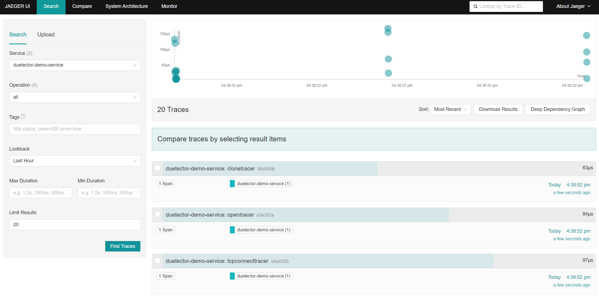

# Integration with OpenTelemetry

[OpenTelemetry](https://opentelemetry.io/) is a collection of APIs, SDKs, and tools that allow development teams to generate, process, and transmit telemetry data in a unified single format.

`duetector` support integration with OpenTelemetry. Through [otel collector](../../duetector/collectors/otel.py), we can export traces to any backend supported by OpenTelemetry.

## Deploy a backend

**If you already have a backend and familiar with OpenTelemetry, you can skip this section.**

Before we start, we need a backend to receive traces. Here we use [jaeger](https://www.jaegertracing.io/) as an example, which is a popular open source tracing backend and supports OpenTelemetry directly.

Deploy [jaeger all in one](https://www.jaegertracing.io/docs/1.50/getting-started/#all-in-one) with docker:

> [Latest jaeger all in one guide](https://www.jaegertracing.io/docs/latest/getting-started/#all-in-one)

```bash
docker run --rm --name jaeger \
  -e COLLECTOR_ZIPKIN_HOST_PORT=:9411 \
  -p 6831:6831/udp \
  -p 6832:6832/udp \
  -p 5778:5778 \
  -p 16686:16686 \
  -p 4317:4317 \
  -p 4318:4318 \
  -p 14250:14250 \
  -p 14268:14268 \
  -p 14269:14269 \
  -p 9411:9411 \
  jaegertracing/all-in-one:1.50
```

Then you can then navigate to http://localhost:16686 to access the Jaeger UI. The port `4317` is for OTLP gRPC receiver, and `4318` is for OTLP http receiver.

### Use otel collector to export traces

If your backend is **NOT** supported by OpenTelemetry, you can deploy a collector to receive traces and export them to your backend.

A simple way is to deploy a collector in [Agent mode](https://opentelemetry.io/docs/collector/deployment/agent/):

Use docker-compose to deploy a collector:

```yaml
otel-collector:
  image: otel/opentelemetry-collector-contrib
  volumes:
    - ./otel-collector-config.yaml:/etc/otelcol-contrib/config.yaml
  ports:
    - 1888:1888 # pprof extension
    - 8888:8888 # Prometheus metrics exposed by the collector
    - 8889:8889 # Prometheus exporter metrics
    - 13133:13133 # health_check extension
    - 4317:4317 # OTLP gRPC receiver
    - 4318:4318 # OTLP http receiver
    - 55679:55679 # zpages extension
```

Here is an example config file:

```yaml
receivers:
  otlp: # the OTLP receiver the app is sending traces to
    protocols:
      grpc:

processors:
  batch:

exporters:
  otlp/jaeger: # Jaeger supports OTLP directly
    endpoint: https://jaeger.example.com:4317

service:
  pipelines:
    traces/dev:
      receivers: [otlp]
      processors: [batch]
      exporters: [otlp/jaeger]
```

For more deployment options, such as load balance, please refer to [OpenTelemetry Collecotr Deployment](https://opentelemetry.io/docs/collector/deployment/).

## Enable Duetector's Otel Collector

To enable duetector's otel collector, we need to set `collector.otelcollector.disabled` to `false` in config file, and set `exporter` and its `exporter_kwargs` to specify the backend. Also, you can use environment variables to set the config.

Here is an example config file:

```toml
[collector.otelcollector]
disabled = false
statis_id = "demo-service"
exporter = "otlp-grpc"

[collector.otelcollector.backend_args]
max_workers = 10

[collector.otelcollector.exporter_kwargs]
endpoint = "localhost:4317"
insecure = true

# disable dbcollector as we don't rely on db to store traces
[collector.dbcollector]
disabled = true
```

Then start duetector with the config file:

```bash
duectl start --config config.toml
```

Access jaeger UI(localhost:16686), you should see traces like this:


