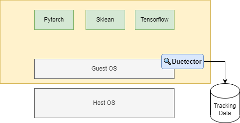

> ⚠ This is not a complete doc, just a sketch.
> We need to add more tracers and maybe a new tool to analyse tracking data.
> For those who are interested in this feature, please follow [#36](https://github.com/hitsz-ids/duetector/issues/36)

# Tracking ML jobs in kata containers

In [run-with-kata-containers](../../how-to/run-with-kata-containers.md) we have shown how to run `duetector` in a kata container. In this section, we will show a user case of tracking ML jobs in kata containers.



## Prepare work dir

First, create a work dir in host machine, then we will mount it to kata container. This is for saving tracking data.

```bash
mkdir ./duetector-kata
```

## Start a kata container

```bash
sudo nerdctl run \
-it --rm \
-p 8888:8888 \
-e DUETECTOR_DAEMON_WORKDIR=/duetector-kata \
-v $(pwd)/duetector-kata:/duetector-kata \
--runtime=io.containerd.kata.v2 \
--cap-add=sys_admin \
--rm \
dataucon/duetector
```

Note:

- JupyterLab is the default entrypoint of `dataucon/duetector` as user application, see [Dockerfile](../../../docker/Dockerfile) and [start-script](../../../docker/start.sh) for change it by yourself.
- `--cap-add=sys_admin` is required for `eBPF` to run properly.
- You can use `--entrypoint bash` to enter the container and run `duetector` manually.
  - you need to mount debugfs manually: `mount -t debugfs debugfs /sys/kernel/debug`
- You can learn how to use GPUs with kata containers in official [kata containers doc](https://github.com/kata-containers/kata-containers/blob/main/docs/use-cases/GPU-passthrough-and-Kata.md) and config its cpu and memory in config file.

## Train a model

We use a example of using `PyTorch` to train a model and save it. You can find the code in [here](./cifar10-rest50-example.ipynb).

It will take a while to train the model. You can change `NUM_EPOCHS` and size of dataset to make it faster.

## Analyse tracking data

TDB
